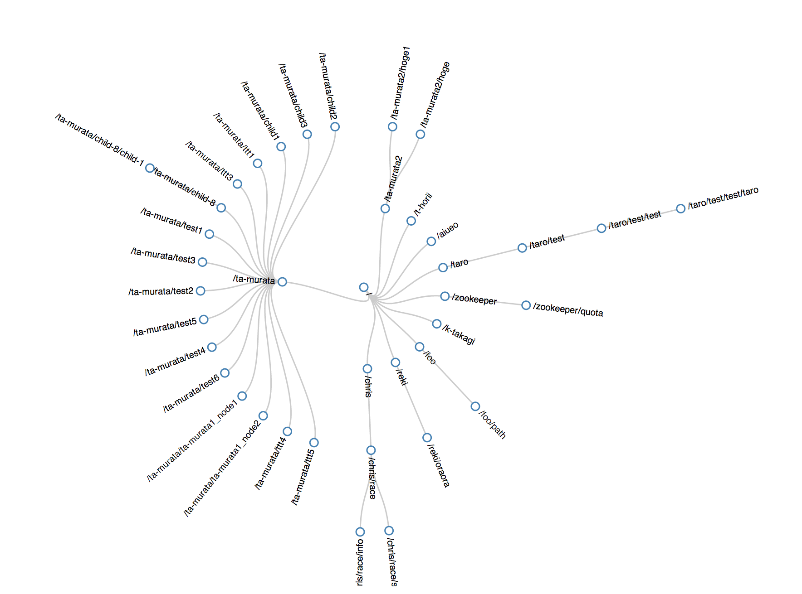

# ZooKeeper Visualization

Recursively retrieves nodes from ZooKeeper and show them on a tree chart. A product of m3dev's [Distribution Systems Tour #1](https://github.com/m3dev/distrib-systems-tour/tree/master/01-zookeeper).

The front-end code was stolen from [Radial Reingold-Tilford Tree](http://bl.ocks.org/mbostock/4063550).

## How to run

1. Make sure you have Node.js 0.10.x.
2. `npm install`
3. Change the host of ZooKeeper in `index.js`.
4. `node index.js`
5. Open `http://localhost:5000`.
